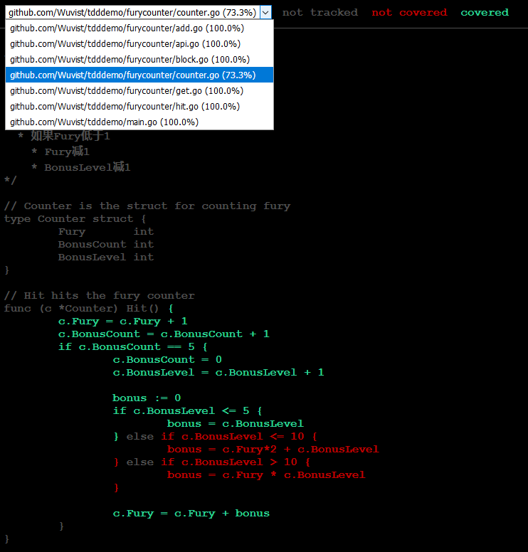

# TDD

TDD需要解决的问题是什么？提高代码质量

那么，我们可以思考，提高代码质量是否有别的更好的手段？

## 两个问题

* 要解决的问题是什么？
* 要解决这个问题，是否有更好的方式？

我发现这时不时使用这两个问题可以很好的避免陷入“为了XX而XX”，把手段误当为目的的思维陷阱中。

# TDD的迷思

TDD能够帮助我们做更好的设计？

* 是的，某些情况下可以
* 但更多的情况下没有影响
* 有的情况下，TDD甚至会伤害代码设计
  * TDD is dead： https://dhh.dk/2014/tdd-is-dead-long-live-testing.html

* 避免使用mock，就直接连数据库
  * 不要为了测试而测试
  * 不要为了“方便测试”而去修改代码设计
  * 让设计来适应代码，而不是代码去适应设计

那么，当前的情况究竟是适合还是不适合？

**自己判断**

**自己判断**

**自己判断**

千万不要使用让**教条**，来代替我们的思考。

* 万物皆对象
* 万物皆资源
* 先写测试再写实现
* 每个函数都必需带有单元测试

# 测试案例的设计

建议以`模块`调用的角度而不是`函数实现`为颗粒度来设计测试案例，即不鼓励教条式的`单元测试`，而更倾向于使用`Acceptance test–driven development` - [ATDD](https://www.wikiwand.com/en/Acceptance_test%E2%80%93driven_development)

具体缘由可以参考[LondonGophers 20/03/2019: Dave Cheney - Absolute Unit (Test)](https://www.youtube.com/watch?v=UKe5sX1dZ0k&t=1451s)

# 测试覆盖

测试代码`覆盖率`是一个方便的手段来帮助我们写测试案例。

以`go`为例，我们可以使用`go test -coverprofile [filename]`的命令格式来将`覆盖率情况`输出到指定文件中。

`profile`文件的内容类似于：

```mode: set
github.com/Wuvist/tdddemo/furycounter/block.go:9.34,11.16 2 0
github.com/Wuvist/tdddemo/furycounter/block.go:15.2,16.9 2 0
github.com/Wuvist/tdddemo/furycounter/block.go:20.2,22.36 2 0
github.com/Wuvist/tdddemo/furycounter/block.go:11.16,13.3 1 0
github.com/Wuvist/tdddemo/furycounter/block.go:16.9,18.3 1 0
github.com/Wuvist/tdddemo/furycounter/counter.go:37.25,40.23 3 1
github.com/Wuvist/tdddemo/furycounter/counter.go:40.23,45.23 4 1
github.com/Wuvist/tdddemo/furycounter/counter.go:53.3,53.26 1 1
github.com/Wuvist/tdddemo/furycounter/counter.go:45.23,47.4 1 1
github.com/Wuvist/tdddemo/furycounter/counter.go:47.9,47.31 1 0
github.com/Wuvist/tdddemo/furycounter/counter.go:47.31,49.4 1 0
github.com/Wuvist/tdddemo/furycounter/counter.go:49.9,49.31 1 0
github.com/Wuvist/tdddemo/furycounter/counter.go:49.31,51.4 1 0
github.com/Wuvist/tdddemo/furycounter/counter.go:58.27,59.16 1 0
...
```

它会记录我们代码中具体行是否已经被测试代码覆盖；亦可以使用网页模式对代码覆盖做更方便的查阅。

假设`go test`输出了`coverprofile`到`p.out`文件，我们可以使用：

```bash
go tool cover -html p.out
```

打开浏览器来对代码覆盖做浏览：



被测试的代码文件覆盖率，未覆盖的代码一目了然。

## 调用命令参考

```bash
go test -coverpkg github.com/Wuvist/tdddemo,github.com/Wuvist/tdddemo/furycounter

go test -coverpkg github.com/Wuvist/tdddemo,github.com/Wuvist/tdddemo/furycounter -coverprofile p.out
go tool cover -html p.out

go test ./... -coverpkg github.com/Wuvist/tdddemo,github.com/Wuvist/tdddemo/furycounter -coverprofile p.out; go tool cover -html p.out
```

# 案例

## 怒气值 FuryCounter

* 用户可以创建 `FuryCounter`，初始值`Fury`，`BonusCount`，`BonusLevel`皆为0
* `Hit`，每次Hit
  * `Fury`加1
  * `BonusCount`加1
* BonusCount等于5时
  * BonusCount归0
  * BonusLevel加1
  * 如果 BonusLevel < 5:
    * Bonus = BonusLevel
  * 如果 BonusLevel > 5:
    * Bonus = Fury * 2 + BonusLevel
  * 如果 BonusLevel > 10:
    * Bonus = Fury * BonusLevel
  * Fury = Fury + Bonus
* `Block`
  * 不影响BonusCount计算
  * 如果Fury大于0
    * Fury归零
    * 不影响BonusCount计算
  * 如果Fury低于1
    * Fury减1
    * BonusLevel减1

## 购物车

截图来自[papi酱 周一放送](https://www.youtube.com/watch?v=Tst5oz1vi5s)


购物车需要支持：

* 优惠卷
  * 立减
* 满减
* 定金
  * 订金膨胀
* 叠加
* 加购指定商品

如果我们需要实现这样的购物车，应当如何实践TDD呢？
