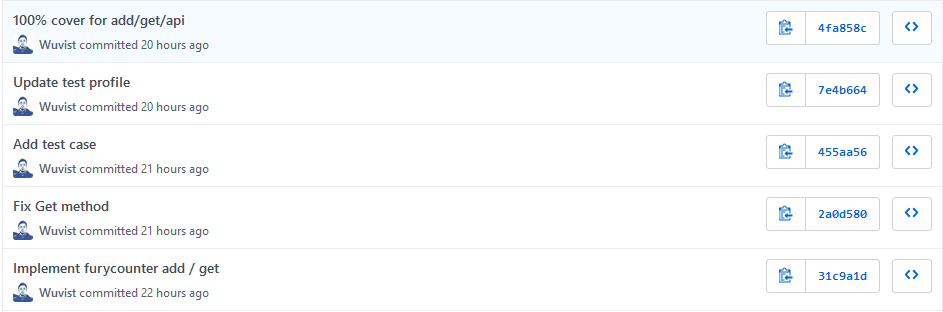

# TDD

## 两个问题

* 要解决的问题是什么？
* 要解决这个问题，是否有更好的方式？

我发现这时不时使用这两个问题可以很好的避免陷入“为了XX而XX”，把手段误当为目的的思维陷阱中。

那么，对于TDD，我们可以问：

> TDD需要解决的问题是什么？

假设说：提高代码质量。

那么，提高代码质量是否有更好的手段？当然，TDD也是提高代码质量的手段之一。

# TDD的迷思

很多TDD的鼓吹者，会宣称TDD能够帮助我们做更好的设计；我认为：

* 是的，某些情况下可以
* 但更多的情况下没有影响
* 有的情况下，TDD甚至会伤害代码设计

DHH的著名文章[TDD is dead](https://dhh.dk/2014/tdd-is-dead-long-live-testing.html)核心观点便是有一些程序为了让代码可以被测试，而修改了原有的代码结构以及使用各种mock，这样的行为，会反过来伤害代码设计/质量。

> 关于这方面的更多讨论，可以参考马丁·福勒的[总结](https://martinfowler.com/articles/is-tdd-dead/)

我们应该避免使用mock，能够直接连数据库进行测试，那么就直接连：

* 不要为了测试而测试
* 不要为了“方便测试”而去修改代码设计
* 让设计来适应代码，而不是代码去适应设计

那么，当前的情况究竟是适合还是不适合？

**自己判断**

**自己判断**

**自己判断**

千万不要使用让`教条`，来代替我们的**思辩**。

以下都是`教条`：

* 万物皆对象
* 万物皆资源
* 必须先写测试再写实现
* 每个函数都必需带有单元测试

`教条`有其适用的场景，也有不适用甚至其反作用的场景：

* 需要我们自己判断，有选择的适用
* 更要注意不要因为对`教条`的厌恶，而忽略了其适用的场景

# 测试案例的实践

在Go语言的实践中，测试编写非常方便；具体到TDD，可以参考[LondonGophers 20/03/2019: Dave Cheney - Absolute Unit (Test)](https://www.youtube.com/watch?v=UKe5sX1dZ0k&t=1451s)的建议：

* 以`模块`调用的角度而不是`函数实现`为颗粒度来设计测试案例
* 不鼓励教条式的`单元测试`
* 更倾向于使用`Acceptance test–driven development` - [ATDD](https://www.wikiwand.com/en/Acceptance_test%E2%80%93driven_development)
* 利用测试代码`覆盖率`来协助编写测试案例

# 测试覆盖率

测试代码`覆盖率`是一个方便的手段来协助我们写测试案例。

以`go`为例，我们可以使用`go test -coverprofile [filename]`的命令格式来将`覆盖率情况`输出到指定文件中。

`profile`文件的内容类似于：

```mode: set
github.com/Wuvist/tdddemo/furycounter/block.go:9.34,11.16 2 0
github.com/Wuvist/tdddemo/furycounter/block.go:15.2,16.9 2 0
github.com/Wuvist/tdddemo/furycounter/block.go:20.2,22.36 2 0
github.com/Wuvist/tdddemo/furycounter/block.go:11.16,13.3 1 0
github.com/Wuvist/tdddemo/furycounter/block.go:16.9,18.3 1 0
github.com/Wuvist/tdddemo/furycounter/counter.go:37.25,40.23 3 1
github.com/Wuvist/tdddemo/furycounter/counter.go:40.23,45.23 4 1
github.com/Wuvist/tdddemo/furycounter/counter.go:53.3,53.26 1 1
github.com/Wuvist/tdddemo/furycounter/counter.go:45.23,47.4 1 1
github.com/Wuvist/tdddemo/furycounter/counter.go:47.9,47.31 1 0
github.com/Wuvist/tdddemo/furycounter/counter.go:47.31,49.4 1 0
github.com/Wuvist/tdddemo/furycounter/counter.go:49.9,49.31 1 0
github.com/Wuvist/tdddemo/furycounter/counter.go:49.31,51.4 1 0
github.com/Wuvist/tdddemo/furycounter/counter.go:58.27,59.16 1 0
...
```

它会记录我们代码中具体行是否已经被测试代码覆盖；亦可以使用网页模式对代码覆盖做更方便的查阅。

假设`go test`输出了`coverprofile`到`p.out`文件，我们可以使用：

```bash
go tool cover -html p.out
```

打开浏览器来对代码覆盖做浏览：


被测试的代码文件覆盖率，未覆盖的代码一目了然以便我们**考虑**是否要增加/修改测试案例来覆盖更多的代码。

## 提醒

`100%覆盖`并通过测试的代码**未必**就代表程序是正确的；因为

* 有可能是测试以及实现都错了
* 有可能测试仍不完备，存在实现没有测试到的场景

而且教条式的追求`100%覆盖`有时反倒有害代码质量；比方说，调用第三方模块，函数接口可能返回错误：

```go
result, err := api.Exec(args)
if err != nil {
  return nil, err
}
```

上面是严谨的代码，但`api.Exec`的目前版本，可能永远都不会出现返回错误的情况，也就是说，调用方的错误处理代码：

```go
if err != nil {
  return nil, err
}
```

是无法被测试覆盖的；如果我们**教条式**的追求`100%覆盖`，就可能需要把代码修改为：

```go
result, _ := api.Exec(args)
```

代码覆盖率虽然上升了，但代码质量实际上却是下降了。

# 案例

下面我们来考虑一个模拟的案例，以及一个真实的案例；看看在实践中可以如何使用测试，或者说TDD来提高我们的代码质量。

## 怒气值 FuryCounter

假设我们需要开发一个格斗游戏，格斗中每次击打`Hit`都会提升角色的怒气值`Fury`；但如果格挡`Block`，则会产生负面影响；然后策划给了这么个方案：

* 可以给角色创建 `FuryCounter`
  * 初始值`Fury`，`BonusCount`，`BonusLevel`皆为0
* `Hit`，每次Hit
  * `Fury`加1
  * `BonusCount`加1
* BonusCount等于5时
  * BonusCount归0
  * BonusLevel加1
  * 如果 BonusLevel < 5:
    * Bonus = BonusLevel
  * 如果 BonusLevel > 5:
    * Bonus = Fury * 2 + BonusLevel
  * 如果 BonusLevel > 10:
    * Bonus = Fury * BonusLevel
  * Fury = Fury + Bonus
* `Block`
  * 不影响BonusCount计算
  * 如果Fury大于0
    * Fury归零
    * 不影响BonusCount计算
  * 如果Fury低于1
    * Fury减1
    * BonusLevel减1

### 简单业务

如果没有`BonusLevel`的话，业务很简单，代码实现也可以非常简单，完全是可以直接写实现代码，然后再考虑添加测试。

我在这个[项目中](https://github.com/Wuvist/tdddemo)尝试来实现`怒气值`，可以看到提交历史：



先实现，再写测试，再追求`100%覆盖`；这里值得一提的是，go语言对于测试的支持非常强大。

测试代码中，实际上是编译、启动了整个程序，跑其了web服务器，然后**真实调用**web接口来进行测试；并且它可以根据被调用的web接口，来判断覆盖率；而且，测试过程**非常快**，基本是秒完成。

开发实践中，工程师不愿意写测试的一个主要原因是因为测试代码麻烦、运行慢；但这点在Go语言中相对不是问题。

### 复杂业务

我们可以明显注意到，由于`BonusLevel`的引入，使得`怒气值`的计算可以变得非常复杂，它甚至还可以是负值；`怒气值`也可以是负，而且，还有`Bonus = Fury * BonusLevel`这是可以要负负得正么？

业务瞬间变得复杂起来，在这样的情况下，我就建议先考虑编写测试案例，然后再写实现。

实际上，对于复杂的业务，我相信在确定测试案例时，就可能会发现需求的一些潜在不合理性（真的要支持负值？），那么，就应该立刻跟策划/产品经理进行沟通，以明确业务需求。

对于复杂的业务，要期盼某个人可以一下子就想清楚所有逻辑，是**不实际**的；实践中，我们更可能需要借用测试案例来帮助我们理清业务，然后再写实现代码。

### 调用命令参考

```bash
go test -coverpkg github.com/Wuvist/tdddemo,github.com/Wuvist/tdddemo/furycounter

go test -coverpkg github.com/Wuvist/tdddemo,github.com/Wuvist/tdddemo/furycounter -coverprofile p.out
go tool cover -html p.out

go test ./... -coverpkg github.com/Wuvist/tdddemo,github.com/Wuvist/tdddemo/furycounter -coverprofile p.out; go tool cover -html p.out
```

## 购物车

截图来自[papi酱 周一放送](https://www.youtube.com/watch?v=Tst5oz1vi5s)


购物车需要支持：

* 优惠卷
  * 立减
* 满减
* 定金
  * 订金膨胀
* 叠加
* 加购指定商品

如果我们需要实现这样的购物车，应当如何实践TDD呢？
